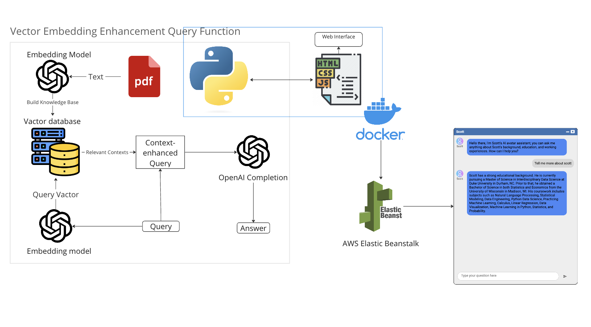

# AI Chatbot with FastAPI and AWS Elastic Beanstalk

## Table of Contents

- [Overview](#overview)
- [Features](#features)
- [Prerequisites](#prerequisites)
- [Installation](#installation)
- [Usage](#usage)
- [API Endpoints](#api-endpoints)
- [Contributing](#contributing)
- [License](#license)
- [Contact](#contact)

## Overview

This project aims to build a conversational AI chatbot using FastAPI and deploy it on AWS Elastic Beanstalk. The chatbot leverages OpenAI's GPT-3 for generating responses and uses FAISS for efficient similarity search.

## Features

- Real-time conversation with the AI chatbot base on GPT-3.5
- PDF document upload for contextual conversations
- Chat interface 
- Deployed on AWS Elastic Beanstalk



## Prerequisites

- Python 3.8 or upper
- FastAPI
- Uvicorn
- OpenAI API Key
- AWS Elastic Beanstalk CLI

## Installation

1. Clone the repository:

```bash
git clone https://github.com/ScottLL/AI-Chatbot.git
```

2. Navigate to the project directory:

```bash
cd AI-Chatbot
```

3. Install the required packages:

```bash
pip install -r requirements.txt
```

4. Create a `.env` file and add your OpenAI API key:

```env
OPENAI_API_KEY=your_openai_api_key_here
```

## Usage

1. Run the FastAPI application:

```bash
uvicorn app:app --host 0.0.0.0 --port 8000
```

2. Open your browser and navigate to `http://localhost:8000`.

## API Endpoints

- `POST /upload/`: Upload PDF files for contextual conversations
    * Replace ```ScottBot.pdf``` with your own promp file (PDF). 
- `POST /ask/`: Send a question to the chatbot
    * need to adjust fetch address ```http://localhost:8000/ask/"``` in ```script.js``` when you deploy the app. 
## Contributing

Pull requests are welcome. For major changes, please open an issue first to discuss what you would like to change.

## License

This project is licensed under the MIT License - see the [LICENSE.md](LICENSE.md) file for details.

## Contact

Scott - scott.lai@duke.edu
